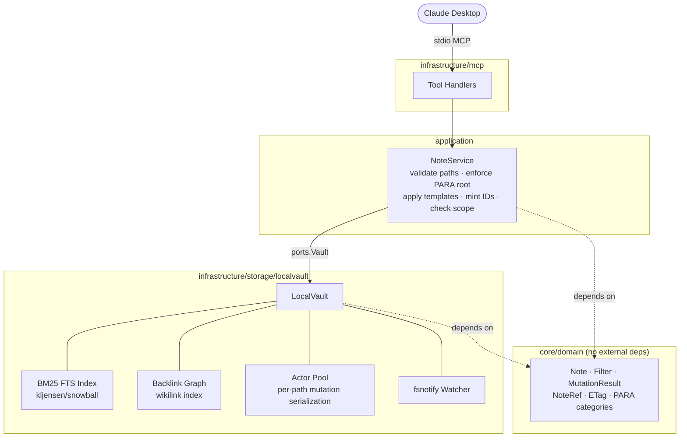
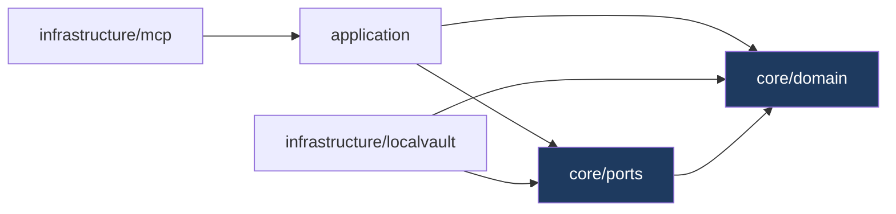

# PARA-MCP

[](LICENSE)

An MCP server for PARA-structured markdown vaults. Gives Claude Desktop (and any MCP client) a structured, token-efficient interface to a local vault of markdown notes organized by the [PARA method](https://fortelabs.com/blog/para/).

```
Projects/  Areas/  Resources/  Archives/
```

Notes are plain `.md` files with YAML frontmatter. Paras indexes them, watches for changes, and exposes 18 MCP tools covering the full CRUD lifecycle -- single notes and batch operations alike.

---

## Installation

```bash
git clone https://github.com/whiskeyjimbo/paras
cd paras
go build -o paras ./cmd/paras
```

Requires Go 1.26.2+.

---

## Claude Desktop Integration

Add paras to your MCP config (`~/Library/Application Support/Claude/claude_desktop_config.json` on macOS):

```json
{
  "mcpServers": {
    "paras": {
      "command": "/path/to/paras",
      "args": [
        "--vault", "/path/to/your/vault",
        "--scope", "personal"
      ]
    }
  }
}
```

Flags:

| Flag | Default | Description |
|------|---------|-------------|
| `--vault` | *(required)* | Path to the vault root directory |
| `--scope` | `personal` | Scope identifier for this vault instance |

---

## Vault Structure

A PARA vault is a directory with four top-level folders:

```
vault/
  projects/    active projects with a defined outcome
  areas/       ongoing responsibilities without an end date
  resources/   reference material and notes
  archives/    completed or inactive items
```

Notes are standard Markdown files. Paras reads and writes YAML frontmatter:

```markdown
---
title: Migrate auth service to Temporal
status: active
area: engineering
project: auth-migration
tags: [temporal, golang, auth]
id: 01JT9XKPQ3...       # stable ULID minted on create
---

Body goes here. [[wikilinks]] to other notes are indexed automatically.
```

---

## MCP Tools

### Single-Note Operations

| Tool | Description |
|------|-------------|
| `note_get` | Read a note by scope and path |
| `note_create` | Create a note; mints a stable NoteID automatically |
| `note_update_body` | Replace a note's body (ETag-gated) |
| `note_patch_frontmatter` | Merge fields into frontmatter; only named keys change |
| `note_move` | Move/rename a note to a new path |
| `note_archive` | Move a note into `archives/` |
| `note_delete` | Delete; `soft=true` moves to `.trash` (default), `soft=false` removes |

### Query & Discovery

| Tool | Description |
|------|-------------|
| `notes_list` | Filter, sort, and paginate note summaries |
| `notes_search` | BM25 full-text search over titles and bodies |
| `notes_backlinks` | Notes that contain a `[[wikilink]]` to the given note |
| `notes_related` | Notes scored by tag/area/project overlap |
| `notes_stale` | Notes not updated within N days |

### Vault Management

| Tool | Description |
|------|-------------|
| `vault_stats` | Note counts by PARA category |
| `vault_health` | Diagnostics: case collisions, unrecognized files, watcher status |
| `vault_rescan` | Force a vault re-index; mints IDs for newly discovered notes |

### Batch Operations

Each batch tool processes items independently -- one failure does not affect siblings.

| Tool | Description |
|------|-------------|
| `notes_create_batch` | Create multiple notes in one call |
| `notes_update_batch` | Update bodies for multiple notes |
| `notes_patch_frontmatter_batch` | Patch frontmatter for multiple notes |

---

## Design Principles

**Summarize by default, hydrate on demand.** List and query tools return lightweight summaries (path, title, tags, status, dates). Full body is only returned by `note_get`.

**Push filtering to the server.** Every query tool accepts structured filters. Notes never land in Claude's context window to be filtered there.

**Aggregations are first-class.** Stats, health, staleness, related-note scoring, and backlinks are dedicated tools -- not something assembled from raw lists.

**Single-call mutations.** Creating or updating a note is one call. No read-modify-write cycles.

---

## Concurrency Model

All writes to a given note are serialized through a per-path actor pool. This prevents races between the filesystem watcher (which maintains the search index) and concurrent mutations.

Mutation responses include an **ETag** -- a Blake3 hash over the note's canonical frontmatter and body. Pass it back as `if_match` on the next write to get optimistic concurrency: the server rejects stale writes with a `conflict` error instead of silently overwriting.

```
// create
{ "etag": "01JT9XKP...", "path": "projects/foo.md", "title": "Foo", ... }

// update with ETag -- succeeds only if nothing changed since the read
note_update_body(scope, path, body, if_match="01JT9XKP...")

// omit if_match to force-overwrite
note_update_body(scope, path, body)
```

---

## Architecture

### Request Flow



### Layer Dependencies



Domain and ports have no infrastructure dependencies. Infrastructure depends inward -- never the reverse.

---

## Development

```bash
# Run tests (includes race detector)
go test -race ./...

# Format
go fmt ./...

# Build
go build ./cmd/paras
```

---

## License

Apache 2.0. See [LICENSE](LICENSE).
